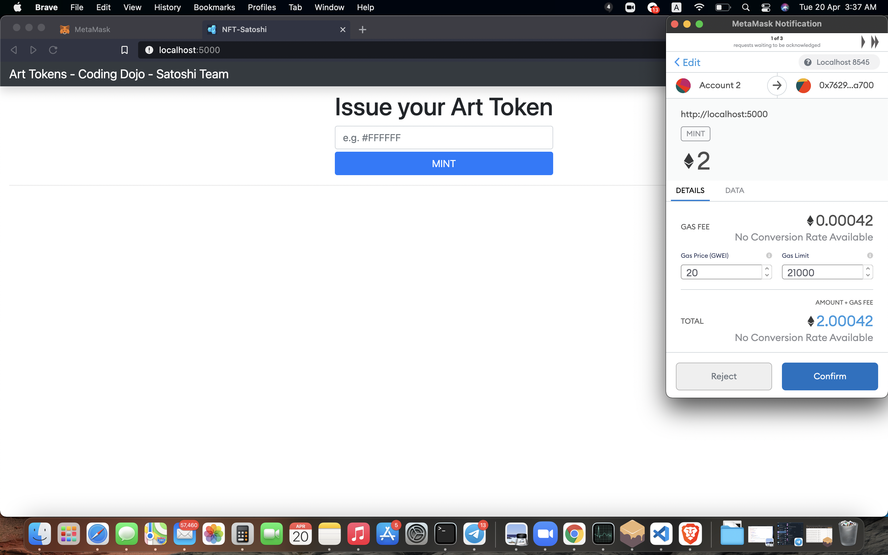

# NFT-Project

## Overview
Our project will build NFT (non-fungible token) smart contracts on ERC721 tokens using solidity, it will show minted images on these tokens. Those minted images (NFT contracts on  ERC721 tokens) will be tradable as unique assets. Once we achieve that we will start trading them, first on NFT trading platforms like opensea.io. Then building our own unique website to trade them. 

## instructions to Install and Use

### Install

- enter the project `cd NFT`
- install npm using `npm i`
- enter the project code 'nft_code', `cd nft_code`
- install npm in the project using `npm i`

### Instractor to run the project

- to compile the project run `Truffle compile
- then to migrate run `Truffle mirgate`
- run `npm run build`
- run `serve -s build`
- Open localhost:5000 in browser
- See frontend connected to the backend

### Instructions to use the project

- You see a frontend on localhost:5000 in the browser
- It will ask you for a color hash to mint
- It will send a request for your meta-mask wallet, make sure your meta-mask wallet connected to the local host network, it uses 7545 port
- It will issue a request

### Project screenshots

#### my opensea account
https://opensea.io/accounts/RayG
